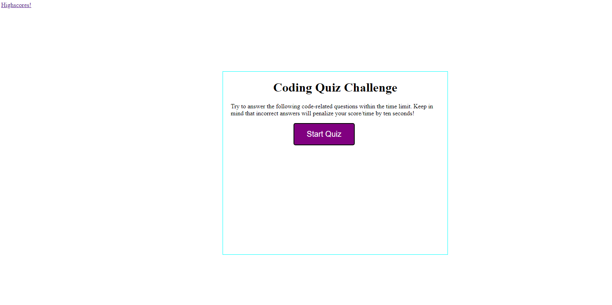

# code-quiz

# Purpose

This repo is building a coding quiz that uses local storage to save your score for all of the attempts. It also uses 2 HTML pages, one for highscores and index.html.
Index.html is the main file that hold the first page, highscores holds all of the scores saved from local storage, if you click clear it will wipe all of the localstorage.
If you click the go back button then you will go back to the index.html and can redo the quiz.

## Built with

- HTML
- CSS
- JavaScript
- LocalStorage

## Image

## Website repo

https://github.com/DanielCConlon/code-quiz

## Github Pages

https://danielcconlon.github.io/code-quiz/
